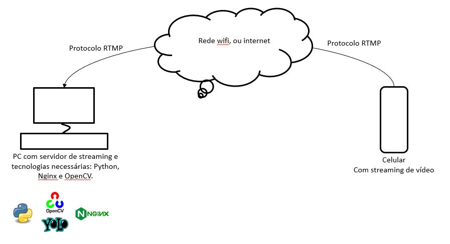

# ObjectDetection-StreamingRTMP
Projeto para usar a câmera de um celular conectado ao servidor **RTMP** e detectar objetos usando **YOLOv4** com **OpenCV**.

Neste projeto criei um servidor NGINX para conectar e receber o streaming de vídeo do celular na rede wifi. Com o streaming capturado, uso a rede de detecção de objetos YOLOv4 para detectar objetos em tempo real com OpenCV.

## O que foi necessário para criar e executar o projeto?
---

1. Criar um servidor de streaming de vídeo usando o **NGINX-RTMP** (Utilizei o Ubuntu 20.04):
    - Neste [link](https://www.digitalocean.com/community/tutorials/how-to-set-up-a-video-streaming-server-using-nginx-rtmp-on-ubuntu-20-04) é possível seguir um tutorial de criação.
>

2. Baixar o aplicativo de celular android PRISM Live no qual é possível fazer um streaming da câmera e direcionar para a rede usando IP do servidor criado com o NGINX:
    - [PRISM Live](https://prismlive.com/en_us/mapp/).
>

3. Executar o script rtmp.py (após o streaming de vídeo com o celular ser iniciado):
    - O script possui o fluxo para ler o video por streaming com a biblioteca **imutils** e processar os dados com **OpenCV**.
    - Passe como parâmetro na chamada do script o caminho do seu streaming de vídeo.
    - É preciso baixar o arquivo com os pesos da rede Yolov4 e colocá-lo na pasta yolo-rtmp. O arquivo pode ser baixado [aqui](https://drive.google.com/file/d/1aed2iucZyqhB9fHyDo3a3dOzvbVYLzt-/view?usp=sharing).

## Erro de conflito do Nginx com Apache
---
O Nginx pode dar conflito com o Apache 2 e não funcionar. Caso isso ocorra, siga os passos do arquivo 'Conflito nginx - apache2.txt'. 

## Como executar?
---
Com tudo pronto execute o seguinte comando:

        python3 rtmp.py 'seu caminho de streaming aqui'
